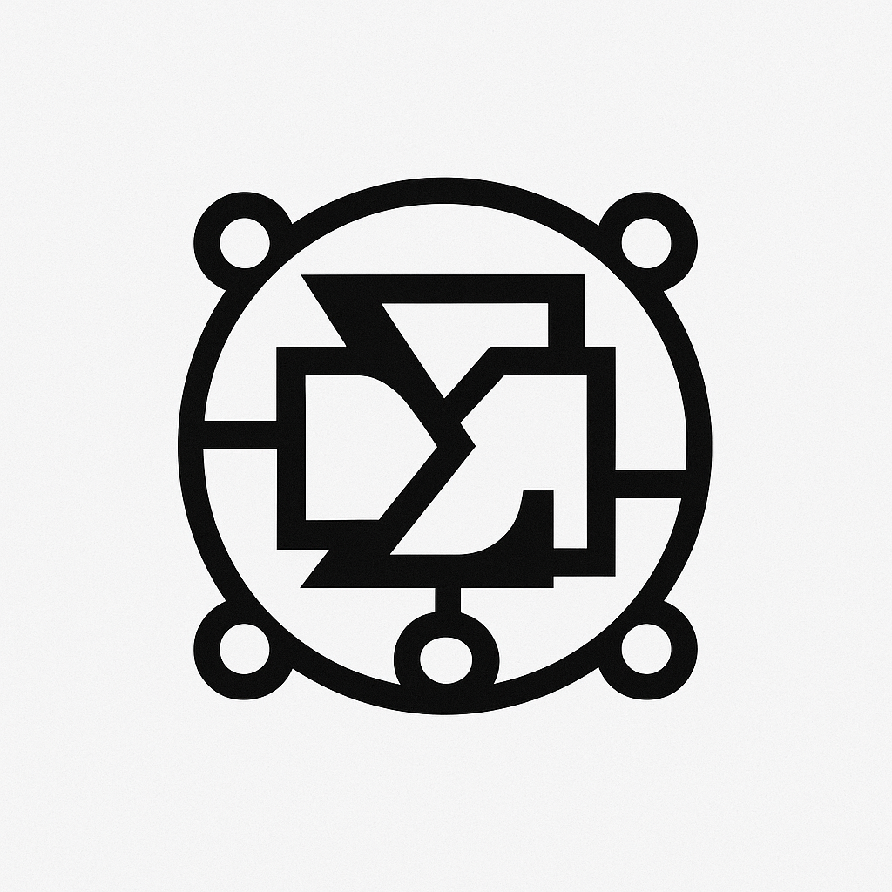

<div align="center">
  
  
  # SIGMOS: Sigma Modular Operating Spec
  
  *A next-generation Domain-Specific Language (DSL) designed to define, orchestrate, and execute AI-native, composable, reactive, and multimodal systems.*
</div>

## 🚀 Features

- **Declarative-first**: Express what should happen, not how
- **Typed & Validated**: Strong types, constraint logic, schema compliance
- **AI-Native**: Prompts, LLM inference, dynamic generation as first-class citizens
- **Composable**: Modular specs, reusable patterns, namespaced imports
- **Extensible**: Plugin-based architecture with secure runtime extensions
- **Reactive**: Trigger-based, event-driven, lifecycle-aware
- **Secure**: Field permissioning, trusted imports, deterministic evaluation

## 📁 Project Structure

```
sigmos/
├── crates/
│   ├── core/          # Grammar, AST, parser
│   ├── runtime/       # Evaluation engine
│   ├── cli/           # CLI binary
│   ├── plugins/       # Official plugins (mcp, rest, etc.)
│   └── transpiler/    # Export formats (json, yaml, etc.)
├── docs/
├── examples/
├── spec/              # DSL EBNF, version log
├── registry/          # Plugin manifest JSON
└── tests/
```

## 🛠️ Installation

```bash
# Clone the repository
git clone https://github.com/copyleftdev/sigmos.git
cd sigmos

# Build the project
cargo build --release

# Install the CLI
cargo install --path crates/cli
```

## 📖 Quick Start

### Basic Specification

```sigmos
spec "Agent" v1.0 {
  description: "Defines an AI Agent with LLM prompt capabilities."

  inputs:
    name: string
    tone: enum("friendly", "hostile")
    api_key: string { secret: true }

  computed:
    greeting: -> "Hello, I'm {{name}}, and I'm {{tone}}."

  events:
    on_create(agent): mcp.call("mission.begin", {
      auth: ref("api_key"),
      payload: { id: agent.name }
    })

  constraints:
    assert name != ""
    ensure tone in ["friendly", "hostile"]

  lifecycle:
    before: validate
    after: log("agent init complete")
}
```

### CLI Usage

```bash
# Validate a specification
sigmos validate spec.sigmos

# Run a specification
sigmos run spec.sigmos

# Transpile to JSON
sigmos transpile spec.sigmos --to json

# Describe a specification
sigmos describe spec.sigmos
```

## 🧪 Development

### Prerequisites

- Rust 1.70+
- Cargo

### Building

```bash
# Check all crates
cargo check --workspace

# Run tests
cargo test --workspace

# Run with all features
cargo test --workspace --all-features
```

### Code Quality

This project enforces strict code quality standards:

- **Zero unsafe code**: All code must be memory-safe
- **Clippy clean**: No warnings allowed
- **Formatted**: `cargo fmt` enforced
- **Documented**: All public APIs have doc comments with examples
- **Tested**: Comprehensive test coverage including doctests

```bash
# Format code
cargo fmt

# Run lints
cargo clippy --workspace --all-targets --all-features -- -D warnings

# Test documentation
cargo test --workspace --doc
```

## 🏗️ Architecture

### Core Components

- **`sigmos-core`**: PEG grammar, AST definitions, parser implementation
- **`sigmos-runtime`**: Async execution engine, event handling, lifecycle management
- **`sigmos-cli`**: Command-line interface with rich error reporting
- **`sigmos-plugins`**: Plugin system and official plugin implementations
- **`sigmos-transpiler`**: Export to JSON, YAML, TOML formats

### Type System

SIGMOS features a rich type system with:
- Primitive types: `string`, `int`, `float`, `bool`, `null`
- Generic types: `list<T>`, `map<K,V>`
- Custom types via `types {}` blocks
- Constraint validation and type checking

### Plugin System

Extend SIGMOS with custom functionality:
- Secure sandboxed execution
- Signature verification
- Runtime registration
- Async plugin methods

## 🤝 Contributing

1. Fork the repository
2. Create a feature branch
3. Make your changes following the code rules
4. Ensure all tests pass and code is formatted
5. Submit a pull request

### Code Rules

- **Idiomatic Rust**: Zero unsafe, strict ownership model
- **Highly Modular**: Decoupled, trait-oriented design
- **Extensive Docstrings**: Every public item documented with examples
- **Property-based Testing**: Use `proptest` for comprehensive testing
- **Strong Typing**: Avoid stringly-typed code, use newtypes

## 📄 License

Licensed under either of:

- Apache License, Version 2.0 ([LICENSE-APACHE](LICENSE-APACHE))
- MIT License ([LICENSE-MIT](LICENSE-MIT))

at your option.

## 🙏 Acknowledgments

SIGMOS is designed for the builders of what comes next - a future-proof DSL for orchestrating cognition, automation, and intelligence across AI-native systems.

---

**SIGMOS**: The modular operating specification for the AI era.
